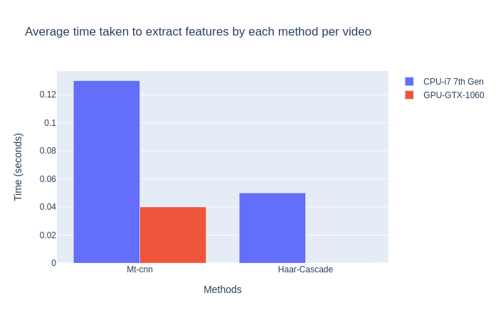
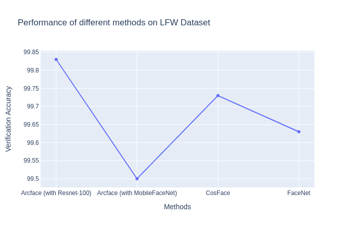
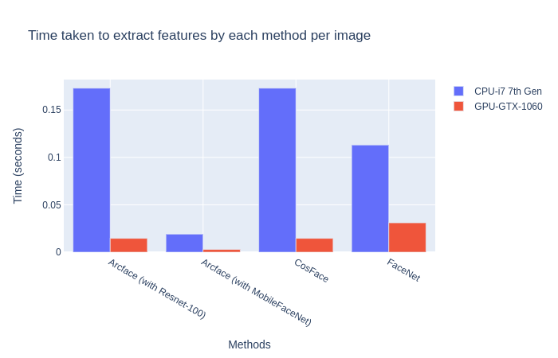

# faceFeatures (Face Recognition Component)


> This component detects multiple human face and provides features for face recognition.   
---
Note: This component is under development


### Table of Contents
- [Description](#description)
- [How To Use](#how-to-use)
- [References](#references)
---

## Description

Facial recognition is used to automatically label an individualin by retrieving it's face features. 

It can be divided into 2 steps: 

- **Detection**: In each frame of the video we need to find the bounding box for each person's face. To choose the technique to integrate, we compare their performance and computation time. 

    

    


    Based on these results, I have integrated mt-cnn as the face-detection model. 

- **Recognition**: Face recognition is a method of identifying or verifying the identity of an individual using their face.

    Top performers: 

    1. [ArcFace](https://arxiv.org/pdf/1801.07698.pdf)
    ```
    Below I discuss 2 versions of ArcFace. 
    1. Using Resnet-100 as the backbone
    2. Using MobileFacenet as the backbone 
    ```
    2. [CosFace](https://arxiv.org/abs/1801.09414)  
    3. Face-net (Currently used by Robocomp)  

        

        

    ```
      Based on these results, I have integrated Arcface as the face-recognition model. 
    ```
 
[Back To The Top](#table-of-contents)

---

## How To Use

**Note:- Installation procedure provided [here](../README.md#how-to-use)**  

#### Starting component
For each module open a new terminal(Crtl-Alt-T)  
```
cd $HOME/robocomp-aston/components/detection/HumanIdentification/faceFeatures
cmake . 
make
```
*To avoid changing the **config** file in the repository, we can copy it to **config-new** in the component's home directory, so changes will remain untouched by future git pulls.*

After editing the new config file we can run each component
```
python3 src/faceFeatures.py 
```

*By default --model = "./src/PretrainedModels/model-y1-test2 & --gpu = 0. See [opt](./src/faceFeatures.py) to see parameters for the module*

---


## References

> [**Mtcnn detection + arc face**](https://github.com/Yoonhee-Gil/mtcnn-arcface),            
> Yoonhee Gil-2019

```
@inproceedings{deng2019retinaface,
title={RetinaFace: Single-stage Dense Face Localisation in the Wild},
author={Deng, Jiankang and Guo, Jia and Yuxiang, Zhou and Jinke Yu and Irene Kotsia and Zafeiriou, Stefanos},
booktitle={arxiv},
year={2019}
}

@inproceedings{guo2018stacked,
  title={Stacked Dense U-Nets with Dual Transformers for Robust Face Alignment},
  author={Guo, Jia and Deng, Jiankang and Xue, Niannan and Zafeiriou, Stefanos},
  booktitle={BMVC},
  year={2018}
}

@article{deng2018menpo,
  title={The Menpo benchmark for multi-pose 2D and 3D facial landmark localisation and tracking},
  author={Deng, Jiankang and Roussos, Anastasios and Chrysos, Grigorios and Ververas, Evangelos and Kotsia, Irene and Shen, Jie and Zafeiriou, Stefanos},
  journal={IJCV},
  year={2018}
}

@inproceedings{deng2018arcface,
title={ArcFace: Additive Angular Margin Loss for Deep Face Recognition},
author={Deng, Jiankang and Guo, Jia and Niannan, Xue and Zafeiriou, Stefanos},
booktitle={CVPR},
year={2019}
}
```

[Back To The Top](#table-of-contents)

---